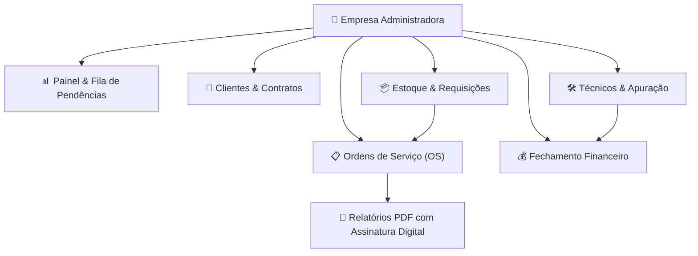

# 🛡️ Apresentação Executiva & Dossiê de Segurança da Informação
### Sistema de Gestão de Manutenção, Atendimentos e Fechamento Financeiro (T-Maint)

---

## 1. Visão Geral da Plataforma

O **T-Maint** é uma plataforma SaaS (Software as a Service) de classe enterprise desenvolvida para digitalizar, otimizar e blindar a operação de empresas de manutenção técnica, automação e prestação de serviços.

A plataforma unifica em um único ambiente intuitivo a **gestão de Ordens de Serviço (OS)**, **atendimento emergencial/corretivo**, **controle de insumos/estoque**, **requisições**, **fechamento financeiro automatizado de técnicos e clientes**, além da **geração de relatórios profissionais com assinatura digital**.

---

## 2. Dossiê de Segurança, Privacidade e Proteção de Dados

Para garantir a confiança dos seus clientes e a proteção total de dados financeiros, contratos e históricos operacionais, o sistema foi projetado sob os mais rigorosos padrões da **LGPD (Lei Geral de Proteção de Dados)** e diretrizes internacionais de segurança cibernética.

> [!IMPORTANT]
> **Isolamento de Dados Multi-tenant em Nível de Banco de Dados**  
> Cada empresa cliente possui seus dados 100% isolados via **Row Level Security (RLS)** no PostgreSQL. É matematicamente e arquiteturalmente impossível para uma empresa visualizar ou acessar registros de outra.

### 🔑 Arquitetura de Segurança em 5 Camadas

| Camada | Tecnologia / Protocolo | Garantia de Segurança |
| :--- | :--- | :--- |
| **1. Criptografia em Trânsito** | HTTPS / TLS 1.3 (256-bit) | Toda a comunicação entre o navegador/celular e o servidor é encriptada contra interceptações (MITM). |
| **2. Criptografia em Repouso** | AES-256 (Supabase Cloud) | Banco de dados e anexos (fotos, documentos, PDFs) são armazenados criptografados em data centers de alta segurança. |
| **3. Autenticação Segura** | JWT (JSON Web Tokens) & Supabase Auth | Controle de sessão com tokens seguros, senhas com hash forte (bcrypt) e proteção contra ataques de força bruta. |
| **4. Controle de Acesso (RBAC)** | Permissões por Papel (Admin vs Técnico) | Técnicos enxergam apenas suas próprias OSs e horas; margens financeiras, contratos e faturamento do cliente são protegidos e restritos ao Administrador. |
| **5. Backup & Redundância** | Cloud Backup Diário Automatizado | Backups diários com retenção e alta disponibilidade, garantindo recuperação contínua contra perda acidental de dados. |

---

## 3. Funcionalidades Detalhadas do Sistema

### 📋 3.1. Gestão Completa de Ordens de Serviço (OS)
- **Acompanhamento em Tempo Real**: Status claro (*⏳ Aguardando Atendimento*, *🚀 Iniciada*, *✅ Fechada*).
- **Classificação por Prioridade Visual**: Alertas por cor (*🔴 Urgente*, *🟠 Alta*, *🔵 Normal*, *⚪ Baixa*).
- **Seções Adicionais e Multidias**: Registro detalhado de horas trabalhadas por dia/técnico, deslocamento em KM, fotos de pré/pós atendimento e peças utilizadas.
- **Relatório PDF Oficial**: Impressão em 1 clique com visual profissional, cabeçalho da empresa, tabela de horas/KM e **campo para assinatura digital** do cliente e do técnico.

---

### ⏱️ 3.2. Painel Executivo & Fila de Atendimentos Pendentes
- **Modo Fila Única de Atendimento**: Visão focada apenas em OSs em aberto, organizadas das mais antigas para as mais recentes para evitar atrasos no SLA.
- **Detalhamento Rápido (Modal Instantâneo)**: Leitura de requisitos, histórico do problema e dados do solicitante sem poluir a tela.
- **Controle Estrito de Fechamento**: Apenas administradores possuem autorização para fechar OSs e alterar níveis de prioridade crítica.

---

### 💵 3.3. Fechamento Financeiro Automatizado & Prevenção de Erros
- **Cálculo Exato de Horas Normais e Extras**: Separação precisa de horas semanais (50%) e finais de semana (100%), eliminando pagamentos duplicados ou cobranças incorretas aos clientes.
- **Apuração de Horas & KM por Técnico**: Relatório consolidado para pagamento mensal de técnicos próprios ou terceirizados.
- **Faturamento por Cliente**: Demonstrativo transparente de horas contratadas vs excedentes.

---

### 📦 3.4. Gestão de Estoque & Requisições de Peças
- **Catálogo de Componentes e Insumos**: Alertas de estoque mínimo, código de peças e preços de custo/venda.
- **Requisições de Peças por OS**: Vínculo direto de componentes consumidos na ordem de serviço com abatimento automático de estoque.

---

### 📱 3.5. Mobilidade para a Equipe de Campo
- **Acesso Responsivo**: Funciona em computadores, tablets e smartphones sem necessidade de instalação pesada.
- **Visualização Filtrada para o Técnico**: O técnico visualiza somente os atendimentos sob sua responsabilidade, podendo registrar apontamentos de hora e foto diretamente em campo.

---

## 4. Por que Escolher o T-Maint? (Argumentos de Venda para o Seu Cliente)

> [!TIP]
> **Diferenciais Competitivos para Apresentações Comerciais:**
> 1. **Zero Papelada e Erros Manuais**: Elimina blocos de papel e planilhas confusas. Tudo fica registrado na nuvem de forma auditável.
> 2. **Transparência Absoluta nas Cobranças**: O relatório em PDF detalha hora de entrada, saída, deslocamento e fotos, criando prova incontestável do serviço prestado.
> 3. **Segurança de Nível Bancário**: Seus dados de contratos, valores de hora e cadastros de máquinas ficam protegidos por criptografia de ponta a ponta.
> 4. **Prontidão no Atendimento**: A fila prioritária por cor garante que atendimentos urgentes sejam iniciados imediatamente.

---

> **Elaborado por:** Equipe de Engenharia e Arquitetura de Software T-Maint  
> **Versão da Documentação:** 2.4 (Atualizada)
